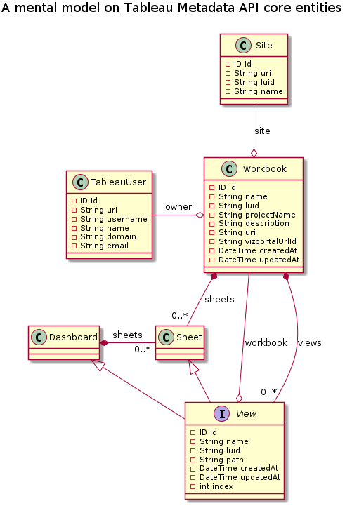

# tableau-metadata-model
Diagrams that help understanding Tableau's Metadata API entities model.

> Disclaimer: this is my personal way of thinking, as a Tableau Metadata API
> early adopter — only & simply this. The model is based on
> [Tableau GraphQL API schema reference][1], **but it's definitely not an
> official reference**.

## 1. Entity Model

### 1.1. Core entities

[1]: https://help.tableau.com/v0.0/api/metadata_api/en-us/reference/index.html
